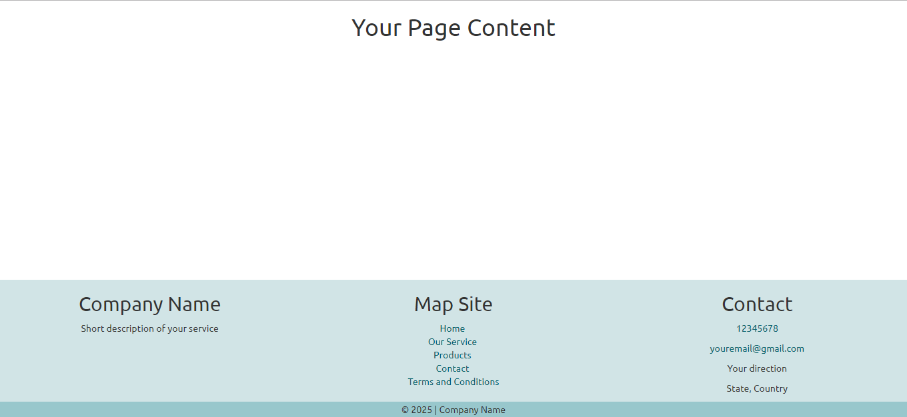
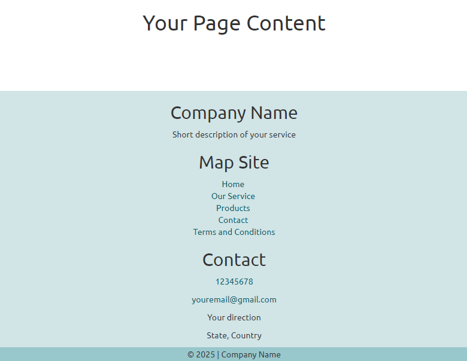

# Responsive Footer using Bootstrap
Hi! this is a simple responsive footer done with bootstrap. Remember if you want to use it, you have to have bootstrap files (css in this case) and the style linked to your project.
For that you need this link on your html head container:

`<link rel="stylesheet" type="text/css" href="bootstrap.min.css">`

`<link rel="stylesheet" type="text/css" href="styles.css">`

All the design (color, fonts) can be changed in the css. :-)

It'll look like this: 

Desktop preview:

Mobile preview:

 
    
